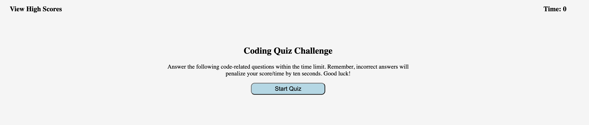

# Web-API-Code-Quiz
## Description
#
This site functions as a study quiz for coding terminology. 

## Installation 
#
The web page was installed through pushing local html, css, and javaScript into github.

## Usage
#
Each correct answer is worth ten points. However, if the user gets a question wrong ten seconds are docked from the clock. 
## Credits
#
Credit goes to the staff for providing us with this complex challenge that helped us dive a little deeper into javascript. 

## License
#
N/A
## Deployment Link 
#
(https://bignate38.github.io/Password-Challenge/)
